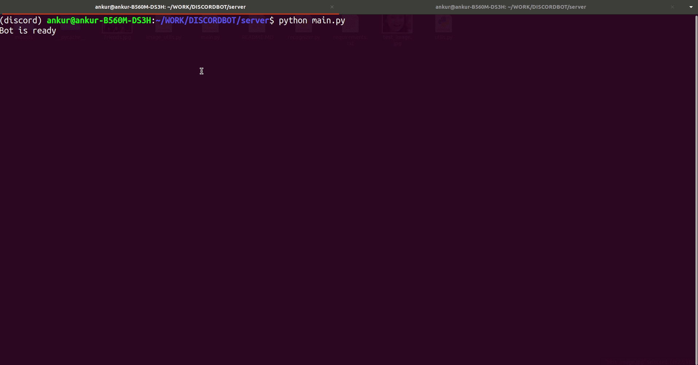

# Face Recognition Discord Bot

This bot analyzes images sent in Discord channels and recognizes faces in them. It uses the Recognizer library to identify the race, age, and emotion of the person in the image.


## Installation

To run this bot locally, please follow the steps below:

1. Clone this repository
2. Install the required dependencies with pip install -r requirements.txt
3. Create a .env file in the root directory of the project and add the following line:

```bash
TOKEN=<your_discord_bot_token>
```

Run the bot with

```bash
python main.py
```

## Usage

To use the bot, simply upload an image with a face in any Discord channel that the bot is present in. The bot will process the image and add a reaction corresponding to the emotion of the person in the image. Additionally, it will send a message with the race, age, and emotion of the person.

Contributing
If you would like to contribute to this project, please feel free to open a pull request or issue.

## License

This project is licensed under the MIT License.